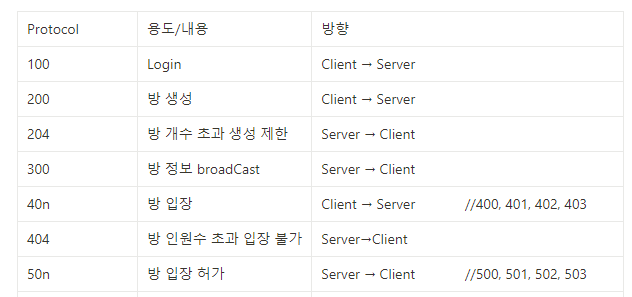
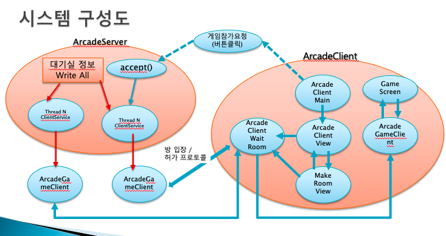

# CrazyArcade   
  
크레이지아케이드 게임 모작 입니다. 
IP와 포트번호를 입력하여 2인 멀티플레이가 가능합니다.
   

- ## 게임 실행 방법 
    ArcadeServer 먼저 실행 후  ArcadeClient 실행하여 메인화면 진입

- 개발환경 : 이클립스 / JAVA SE-14

- 개발언어 : JAVA
  
---
 

## 구동화면    

- 메인 화면 

 
 
 
 
- 대기실 (초기) 
  
- 대기실 방 만들기 
  
- 대기방 입장 
  
- 게임 시작 
  
- 결과 화면 
  
---
  
## 특징

- 아이템은 총 3가지가 있습니다  
    - 스피드업 : 속도가 빨라집니다 최대속도 제한이 있습니다.
    - 물줄기 업 : 물줄기가 길어집니다. 최대길이 제한이 있습니다.
    - 물풍선 개수 업 : 물풍선 설치 최대 개수가 증가합니다. 최대 갯수 제한이 있습니다.  
- TCP/IP 를 활용하여 멀티플레이가 가능합니다.    
- ## 프로토콜 테이블
  
- ## 시스템 구성도
  
